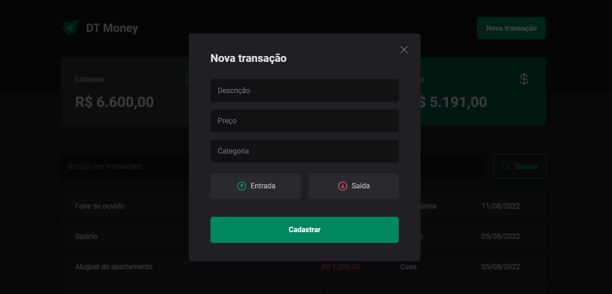
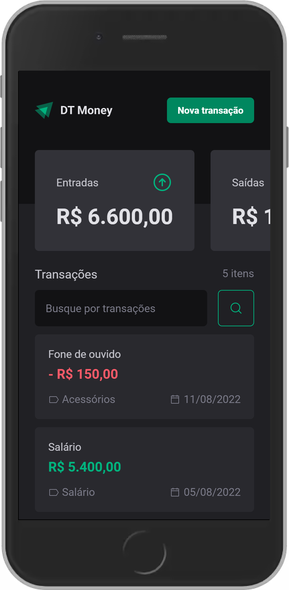
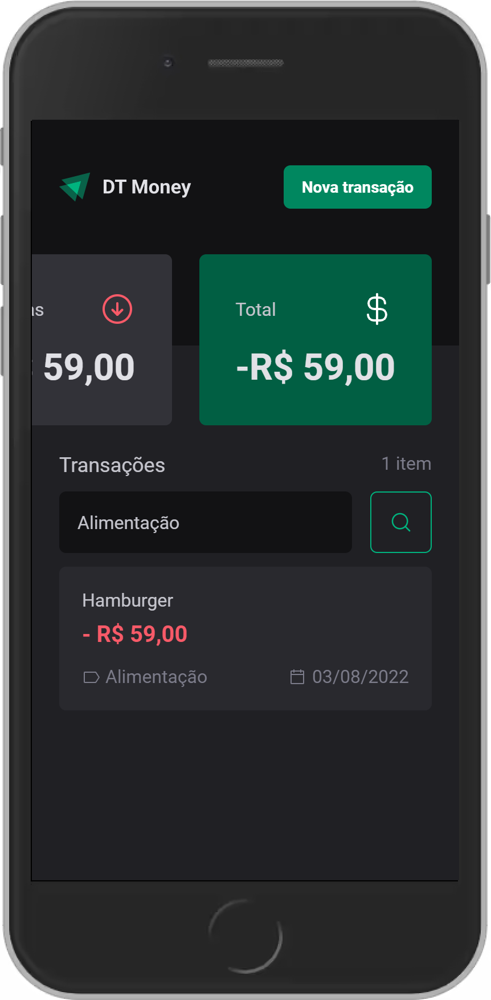
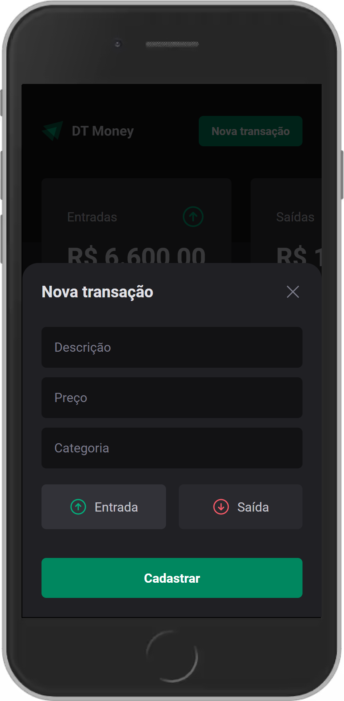

<div align="center">
  
</div>

# DT Money

Aplicação web para controle financeiro pessoal desenvolvida durante o Bootcamp Ignite da Rocketseat na trilha ReactJS.

## 📋 Sobre o Projeto

O DT Money é uma aplicação de gerenciamento financeiro que permite aos usuários controlar suas finanças através de um dashboard intuitivo. Com ele, é possível registrar entradas e saídas, visualizar o saldo total e buscar transações específicas.

### ✨ Funcionalidades

- Visualização das transações (entradas e saídas)
- Cálculo automático de entradas, saídas e saldo total
- Filtro de busca para encontrar transações específicas
- Cadastro de novas transações via modal
- Design responsivo para desktop e dispositivos móveis

## 🚀 Tecnologias

O projeto foi desenvolvido utilizando as seguintes tecnologias:

- **[React.js](https://reactjs.org/)** (v18.2.0) - Biblioteca para construção de interfaces
- **[Vite](https://vitejs.dev/)** (v3.0.0) - Build tool e server de desenvolvimento
- **[TypeScript](https://www.typescriptlang.org/)** (v4.6.4) - Superset JavaScript com tipagem estática
- **[Styled Components](https://styled-components.com/)** (v5.3.5) - Biblioteca para estilização com CSS-in-JS
- **[React Router Dom](https://reactrouter.com/)** (v6.3.0) - Roteamento para aplicações React
- **[Radix UI](https://www.radix-ui.com/)** (v1.0.0) - Biblioteca de componentes acessíveis
  - Dialog
  - Radio Group
- **[React Hook Form](https://react-hook-form.com/)** (v7.34.0) - Gerenciamento de formulários
- **[JSON-Server](https://github.com/typicode/json-server)** (v0.17.0) - Simulação de API REST

## 💻 Layout

### Desktop

<div align="center">
  <div style="display: flex; gap: 20px;">
    <div>
      <p align="center"><strong>Página Inicial</strong></p>
      
    </div>
    <div>
      <p align="center"><strong>Modal de Nova Transação</strong></p>
      
    </div>
  </div>
</div>

### Mobile

<div align="center">
  <div style="display: flex; gap: 10px;">
    <div>
      <p align="center"><strong>Home</strong></p>
      
    </div>
    <div>
      <p align="center"><strong>Lista de Transações</strong></p>
      
    </div>
    <div>
      <p align="center"><strong>Modal</strong></p>
      
    </div>
  </div>
</div>

## 🚦 Como executar

```bash
# Clone este repositório
$ git clone https://github.com/joaomjbraga/dt-money_Rocket.git

# Acesse a pasta do projeto
$ cd dt-money

# Instale as dependências
$ npm install
# ou
$ yarn install

# Execute o JSON Server (API fake)
$ npm run dev:server
# ou
$ yarn dev:server

# Execute o projeto
$ npm run dev
# ou
$ yarn dev
```

O servidor de desenvolvimento será iniciado na porta 5173 - acesse [http://localhost:5173](http://localhost:5173)

## 📝 Licença

Este projeto está sob a licença MIT. Veja o arquivo [LICENSE](LICENSE) para mais detalhes.

<div align="center">
  <p>Desenvolvido com 💜</p>
  <p>
    <a href="https://github.com/seu-usuario">
      
    </a>
    <a href="https://www.linkedin.com/in/seu-usuario/">
      
    </a>
  </p>
</div>